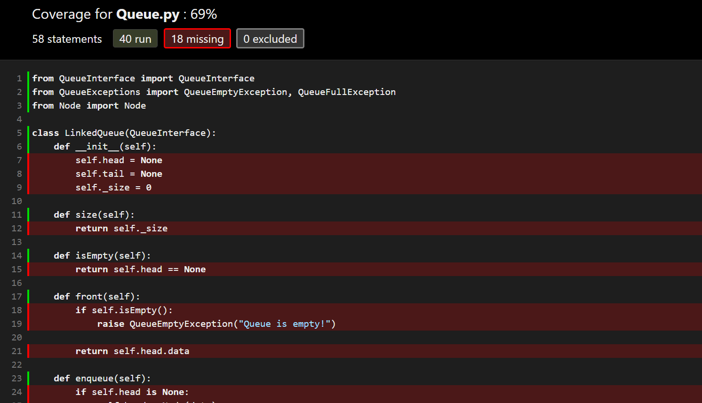

# Python Basics
Code snippets used as examples for the course `CMSC 121 - Web Programming`. 

Some examples are based from [CS50 Web Programming with Python and JavaScript](https://cs50.harvard.edu/web/2020/notes/2/).

## Table of Contents
- [Input/Output](hello.py)

- [Formatted Strings](hello.py)

- [Conditions](cond.py)

- [Sequences (Strings, Lists, Tuples, Sets)](sequences.py)

- [Dictionaries](sequences.py)

- [Loops](loops.py)

- [Modules and Functions](function.py)

- Object-Oriented Programming
    
    - [Introduction to Classes](Classes/)
    - [Examples: QueueInterface, LinkedQueue and ArrayQueue](Queue/)

- Exception Handling
    - [Examples: QueueExceptions.py](Queue/)

- [Functional Programming](Functional/)
    
    - [Lambda Functions](Functional/anonymous_functions.py) 

    - [Decorators](Functional/decorators.py)

- Introduction to Unit Testing and Code Coverage

    - [Module `unittest` Documentation](https://docs.python.org/3/library/unittest.html)

    - [Unit Test Example: QueueTest.py](Queue/)

    - [Effective Unit Test Cases & Code Coverage](https://www.atlassian.com/continuous-delivery/software-testing/code-coverage)

    - [Code Coverage module in Python](https://coverage.readthedocs.io/en/coverage-5.5/)

    - [Code Coverage Report Example](Queue/coverage_html/CoverageReportScreenshot.PNG)

## Sample Code Coverage Report

The sample code coverage report above tells us that the implementation for the `LinkedQueue` class is not thoroughly tested yet, we can write unit tests targeting each of the `LinkedQueue`'s methods to increase code coverage. We often aim to cover most of our code.

